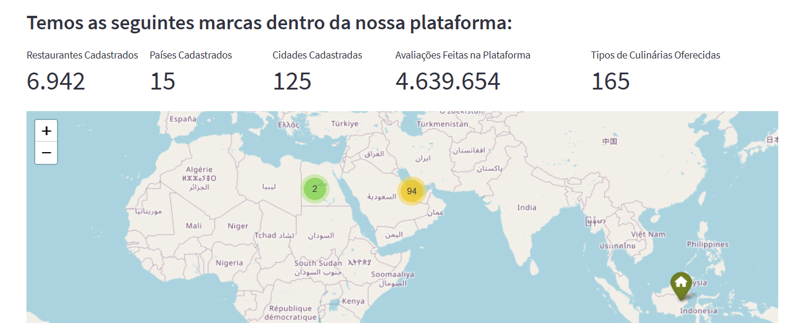

## Food Company

Análisar e retirar insights importantes apasrtir dos dados de uma empresa chamada Cury Company, a qual possui um modelo de negócio chamado Marketplace. A empresa realiza negócios entre restaurantes, entregadores e pessoas, e gera muitos dados sobre entregas, tipos de pedidos, condições climáticas, avaliação dos entregadores e etc. Apesar da entrega estar crescendo o CEO não tem visibilidade completa dos KPIs de crescimento da empresa.

 

## Questão de negócio
Criar soluções de dados fornecendo ao CEO os principais KPIs estratégicos organizados em uma única ferramenta, para que o ele possa consultar e conseguir tomar decisões importantes.

## Premissas assumidas para a análise
1. A análise foi realizada com dados entre 11/02/2022 e 06/04/2022.
2. Marketplace foi o modelo de negócio assumido.

## Ferramentas Utilizadas
- Python
- Versionador de código Git
- Aplicação Jupyter Notebook
- Serviço de Hospedagem Streamlit Cloud

## Top 3 Insights de dados
1. A sazonalidade da quantidade de pedidos é diária. Há uma variação de aproximadamente 10% do número de pedidos em dia sequenciais.
2. As cidades do tipo Semi-Urban não possuem condições baixas de trânsito.
3. As maiores variações no tempo de entrega, acontecem durante o clima ensoladao.

## Entregue Final
Painel online, hospedado em um Cloud e disponível para acesso em qualquer dispositivo conectado à internet.
O painel pode ser acessado através desse link: https://foodmarketplace.streamlit.app/

